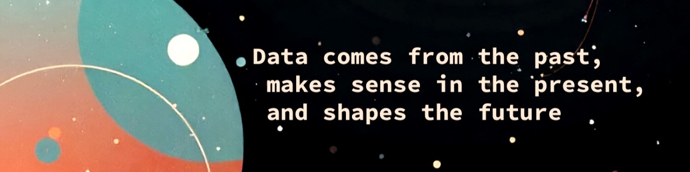

  

# 👋 Hola, soy Luis

Soy **Matemático** de formación, en transición hacia la **Ciencia de Datos**, con especial interés en el **análisis de datos**, el **modelado estadístico** y el **aprendizaje automático** aplicado a problemas reales.

Actualmente trabajo en proyectos relacionados con:
- Análisis exploratorio de datos (EDA)
- Modelos de Machine Learning clásicos
- Visualización y comunicación de resultados
- Enseñanza de matemáticas y ciencia de datos

## 🧠 Áreas de interés
- Ciencia de Datos
- Machine Learning
- Deep Learning
- Estadística aplicada
- Optimización
- Educación universitaria en matemáticas y datos

## 📫 Contacto

## 🛠️ Tecnologías y herramientas

### Lenguajes de Programación

### Herramientas y Frameworks

### En Desarrollo

### Otros

## 🚀 Proyectos Destacados

| Proyecto | Descripción | Stack Principal | Estado |
|----------|-------------|-----------------|---------|
| **[COL-MEN-STAT](https://github.com/Ori-G-A/COL_MEN_STAT)** | Análisis de cobertura y deserción educativa en Colombia |     | 🔄 En curso|
| **[Puestos Sensibles](https://github.com/LuisJRubioH/Puestos_Sensibles_Corrupcion)** | Caracterización de cargos públicos vulnerables a corrupción |    | 🔄 En curso |
| **[Toradamus](link)** | Resolución de acertijos matemáticos con Python |   | ✅ Completo |

## 📌 Actividad Reciente
<!--- stats & Trophy (start) -->

  <!--- stats (start) -->
<table align="center">
<tr border="none">
<td width="50%" align="center">

  
   
  
</td>

<td width="50%" align="center">

  
  
  </td>
</tr>
</table>
<!--- stats (end) -->

<!--
**LuisJRubioH/LuisJrubioH** is a ✨ _special_ ✨ repository because its `README.md` (this file) appears on your GitHub profile.

Here are some ideas to get you started:

- 🔭 I’m currently working on ...
- 🌱 I’m currently learning ...
- 👯 I’m looking to collaborate on ...
- 🤔 I’m looking for help with ...
- 💬 Ask me about ...
- 📫 How to reach me: ...
- 😄 Pronouns: ...
- ⚡ Fun fact: ...
-->
